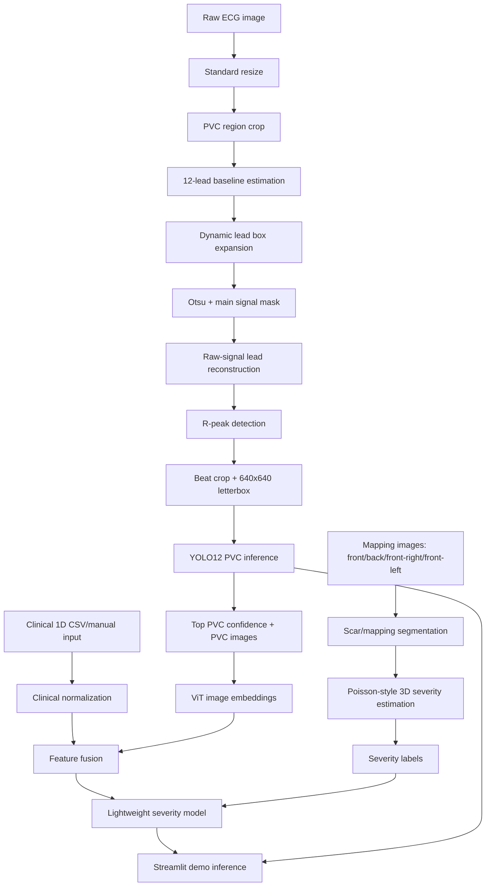

# ECG PVC and Severity Estimation Pipeline


This repository contains the research pipeline for PVC beat extraction from 12-lead ECG images and downstream severity estimation using clinical 1D data, YOLO PVC detections, image embeddings, and mapping-derived severity labels.

The project is organized as a reproducible notebook workflow, with a Streamlit app used only for demo inference and presentation.

## Research Overview

The pipeline performs:

1. Data organization for valid patient ECG and mapping files.
2. ECG image preprocessing from raw 12-lead ECG screenshots.
3. Dynamic lead segmentation and signal masking.
4. Beat reconstruction from raw ECG signal regions into 640x640 YOLO inputs.
5. YOLO12 PVC detection using Nano, Small, and Medium variants.
6. Clinical 1D feature normalization.
7. PVC image feature extraction using a ViT-based embedding workflow.
8. Feature fusion between clinical data, PVC confidence scores, and image embeddings.
9. Severity label generation from mapping images.
10. Lightweight outcome and severity model training.
11. Streamlit inference demo using uploaded ECG image and clinical data.

## Architecture



## Repository Structure

```text
.
├── apps/
│   └── ecg_inference_app.py
├── data/
│   ├── patient/
│   │   └── valid/
│   │       ├── P-00001/
│   │       ├── P-00002/
│   │       ├── P-00007/
│   │       └── P-00015/
│   ├── ecg-data/
│   ├── ecg-data-features/
│   ├── model-training-lightweight/
│   └── severity-labels/
├── examples/
│   ├── patient_01_clinical_features_raw_example.csv
│   ├── patient_02_clinical_features_raw_example.csv
│   ├── patient_07_clinical_features_raw_example.csv
│   └── patient_15_clinical_features_raw_example.csv
├── notebook-process/
│   ├── preprocess_ecg_pvc_crop.ipynb
│   ├── training_yolo_pvc.ipynb
│   ├── visualize_pvc_inference_on_raw_ecg.ipynb
│   ├── feature_fusion_clinical_pvc_vit.ipynb
│   ├── severity_label_from_mapping_poisson3d.ipynb
│   └── training_lightweight_outcome_severity.ipynb
├── runs/
│   └── yolo_pvc/
├── app_run.sh
├── run_app.sh
├── pyproject.toml
└── README.md
```

## Environment Setup

This project uses `uv`.

```bash
uv sync
```

Start Jupyter:

```bash
uv run jupyter lab
```

## Data Download and Placement

Download the research data from:

[link-download]

After downloading, place the data in this structure:

```text
data/
├── PENELITIAN PVC TELKOM - Sheet1.csv
├── patient/
│   └── valid/
│       ├── P-00001/
│       │   ├── ecg/
│       │   │   └── ecg-raw.png
│       │   └── mapping/
│       │       └── used/
│       │           ├── front.jpg
│       │           ├── back.jpg
│       │           ├── front-right.jpg
│       │           └── front-left.jpg
│       ├── P-00002/
│       ├── P-00007/
│       └── P-00015/
└── ecg-data/
    ├── data.yaml
    ├── train/
    ├── val/
    └── test/
```

Important naming rules:

- Raw ECG images must be named `ecg-raw*`, for example `ecg-raw.png` or `ecg-raw.jpeg`.
- Mapping images used for severity estimation must be inside `mapping/used/`.
- The four expected mapping views are `front`, `back`, `front-right`, and `front-left`.
- YOLO training data should be placed in `data/ecg-data/` and should follow YOLO image/label format.

## Notebook Execution Order

Run the notebooks in this order.

### 1. ECG preprocessing and beat extraction

```text
notebook-process/preprocess_ecg_pvc_crop.ipynb
```

This notebook:

- Loads valid patient raw ECG images.
- Resizes ECG images to the standardized reference scale.
- Crops the PVC ECG region.
- Estimates 12-lead baselines.
- Builds dynamic lead boxes.
- Applies signal masking.
- Reconstructs raw-signal lead strips.
- Detects R-peaks.
- Generates 640x640 beat inputs for YOLO.
- Saves coordinate metadata for mapping YOLO predictions back to the raw ECG.

Key output examples:

```text
data/patient/valid/{PATIENT_ID}/ecg/segmentation-validation/
├── cycle-yolo-reconstructed-inputs/
├── cycle_raw_coordinate_metadata.json
├── 08_reconstructed_640_rpeak_windows.png
├── 09_cycle_crops_yolo_input.png
└── 10_rpeaks_on_standardized_ecg.png
```

### 2. YOLO PVC training

```text
notebook-process/training_yolo_pvc.ipynb
```

This notebook trains YOLO12 variants:

- YOLO12 Nano
- YOLO12 Small
- YOLO12 Medium

Expected model outputs:

```text
runs/yolo_pvc/
├── yolo12_nano_pvc/weights/best.pt
├── yolo12_small_pvc/weights/best.pt
└── yolo12_medium_pvc/weights/best.pt
```

The Streamlit app can select any of these models from a dropdown.

### 3. YOLO inference visualization on raw ECG

```text
notebook-process/visualize_pvc_inference_on_raw_ecg.ipynb
```

This notebook:

- Runs YOLO inference on reconstructed 640x640 beat inputs.
- Saves inference results for Nano, Small, and Medium.
- Maps bounding boxes back to the original ECG image.
- Saves per-patient PVC detection outputs.

Key output:

```text
data/ecg-data-features/{PATIENT_ID}/
├── detections_all_models.csv
├── cycle_predictions_all_models.csv
├── yolo12_nano/
├── yolo12_small/
└── yolo12_medium/
```

### 4. Clinical + PVC + ViT feature fusion

```text
notebook-process/feature_fusion_clinical_pvc_vit.ipynb
```

This notebook:

- Loads clinical 1D data.
- Normalizes risk factors, echo, and Holter features.
- Selects up to 5 highest-confidence PVC detections from YOLO12 Medium.
- Extracts image embeddings from selected PVC beats using a ViT-based feature extractor.
- Builds a fusion-ready feature matrix.

Key output:

```text
data/ecg-data-features/fusion-ready/
├── clinical_features_raw.csv
├── clinical_features_normalized.csv
├── clinical_normalization_params.json
├── selected_medium_pvc_top5.csv
├── fusion_features.csv
├── fusion_feature_names.csv
└── fusion_matrix.npy
```

### 5. Severity labels from mapping images

```text
notebook-process/severity_label_from_mapping_poisson3d.ipynb
```

This notebook:

- Loads mapping images from `mapping/used/`.
- Segments scar/mapping color regions.
- Ignores background and shadow-like regions.
- Estimates severity percentage from four views.
- Applies a higher weight to the back view.
- Produces severity labels for model training.

Key output:

```text
data/severity-labels/
├── severity_labels.csv
├── severity_view_stats.csv
├── severity_label_metadata.json
└── all_patients_severity_prediction_summary.png
```

### 6. Lightweight success and severity training

```text
notebook-process/training_lightweight_outcome_severity.ipynb
```

This notebook:

- Combines fusion features and severity labels.
- Trains lightweight Ridge-based models.
- Compares compact clinical/PVC features against top-k fusion features.
- Saves the final severity model.

Key output:

```text
data/model-training-lightweight/
├── final_lightweight_severity_ridge_model.npz
├── severity_model_options_loocv.csv
├── severity_train_predictions_final_model.csv
├── success_model_summary.json
└── training_summary.json
```

## Running Notebooks From Terminal

Each notebook can be executed with:

```bash
uv run jupyter nbconvert --execute --inplace notebook-process/preprocess_ecg_pvc_crop.ipynb --ExecutePreprocessor.timeout=1200
```

Replace the notebook path as needed.

Recommended terminal order:

```bash
uv run jupyter nbconvert --execute --inplace notebook-process/preprocess_ecg_pvc_crop.ipynb --ExecutePreprocessor.timeout=1200
uv run jupyter nbconvert --execute --inplace notebook-process/training_yolo_pvc.ipynb --ExecutePreprocessor.timeout=1200
uv run jupyter nbconvert --execute --inplace notebook-process/visualize_pvc_inference_on_raw_ecg.ipynb --ExecutePreprocessor.timeout=1200
uv run jupyter nbconvert --execute --inplace notebook-process/feature_fusion_clinical_pvc_vit.ipynb --ExecutePreprocessor.timeout=1200
uv run jupyter nbconvert --execute --inplace notebook-process/severity_label_from_mapping_poisson3d.ipynb --ExecutePreprocessor.timeout=1200
uv run jupyter nbconvert --execute --inplace notebook-process/training_lightweight_outcome_severity.ipynb --ExecutePreprocessor.timeout=1200
```

For YOLO training, GPU is recommended. If weights are already available in `runs/yolo_pvc/`, the training notebook can be skipped for demo inference.

## Streamlit Demo Inference

Run the app:

```bash
PORT=8501 bash app_run.sh
```

Open:

```text
http://localhost:8501
```

You can use another port:

```bash
PORT=8502 bash app_run.sh
```

The app accepts:

- Raw ECG image upload.
- Clinical 1D CSV upload.
- Manual clinical 1D input.
- YOLO model selection: Nano, Small, or Medium.
- Crop preset adjustment using Left, Right, Top, and Bottom sliders.

Example clinical CSV files are available in:

```text
examples/
├── patient_01_clinical_features_raw_example.csv
├── patient_02_clinical_features_raw_example.csv
├── patient_07_clinical_features_raw_example.csv
└── patient_15_clinical_features_raw_example.csv
```

For a standard demo:

1. Upload `data/patient/valid/P-00001/ecg/ecg-raw.png`.
2. Upload `examples/patient_01_clinical_features_raw_example.csv`.
3. Set Patient ID to `P-00001`.
4. Select a YOLO model.
5. Keep `Use cached ViT fusion when the patient ID is valid` enabled if the precomputed fusion vectors are available.
6. Click `Run inference`.

The terminal prints inference progress:

```text
[Inference] Starting ECG inference pipeline.
[Inference] Step 1/7 - Standardizing raw ECG image.
[Inference] Step 2/7 - Estimating 12-lead baselines.
[Inference] Step 3/7 - Building dynamic lead boxes and masks.
[Inference] Step 4/7 - Reconstructing raw-signal beats at 640x640.
[Inference] Step 5/7 - Running YOLO PVC detection.
[Inference] Step 6/7 - Estimating severity from clinical and PVC features.
[Inference] Step 7/7 - Completed.
```

## Streamlit Output

The app displays:

- Main inference output:
  - Average PVC per lead.
  - PVC detected in all leads.
  - Inference status.
  - Severity estimate.
- Raw ECG preview.
- Crop preview.
- Lead segmentation mask overlaid on the original ECG.
- Beat-level YOLO inputs.
- Raw ECG with beat boxes.
- Raw ECG with PVC bounding boxes.
- Detection summary tables.

## Notes and Limitations

- The current valid cohort contains four patients: `P-00001`, `P-00002`, `P-00007`, and `P-00015`.
- The severity model is lightweight because the sample size is small.
- The Streamlit app is designed for demo inference and presentation, not for clinical deployment.
- Severity estimation depends on mapping-image quality and the assumptions used in the mapping segmentation notebook.
- PVC detection depends on YOLO weights in `runs/yolo_pvc/`.
- If cached ViT fusion is disabled or unavailable, the demo uses current YOLO PVC confidence scores and fills missing image embedding features with zero.

## Useful Commands

Install dependencies:

```bash
uv sync
```

Open notebooks:

```bash
uv run jupyter lab
```

Run Streamlit:

```bash
PORT=8501 bash app_run.sh
```

Check the app script:

```bash
uv run python -m py_compile apps/ecg_inference_app.py
```
